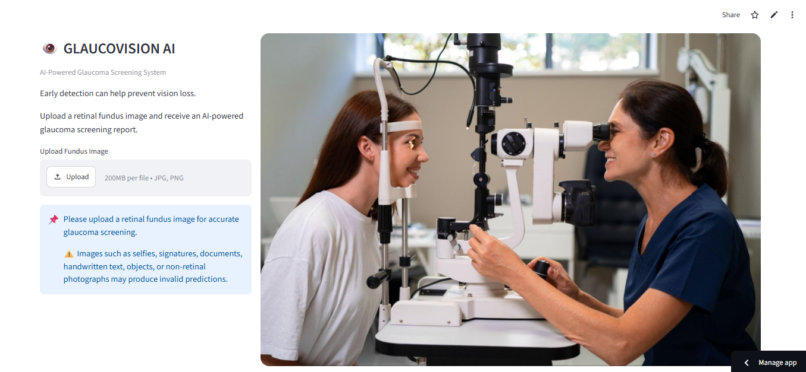
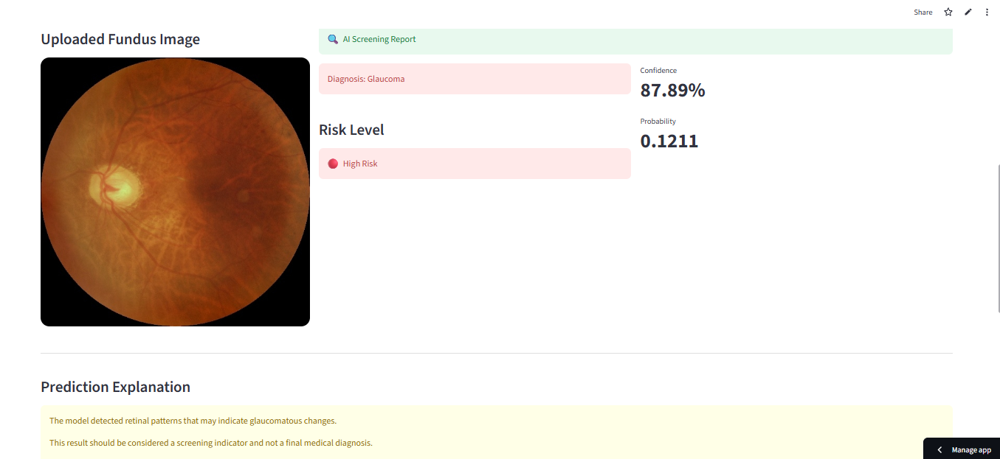
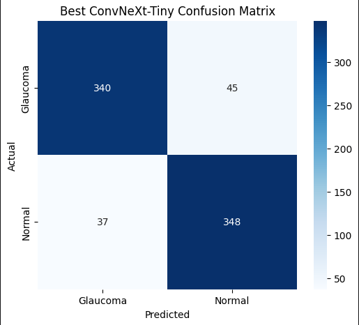
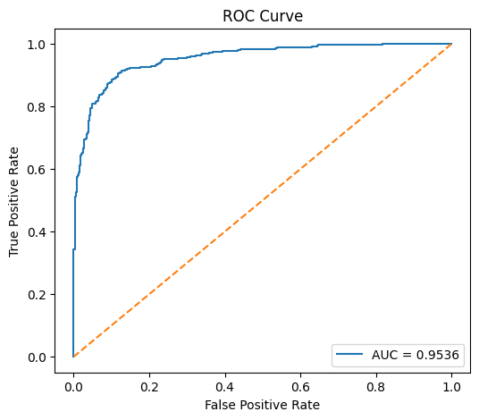
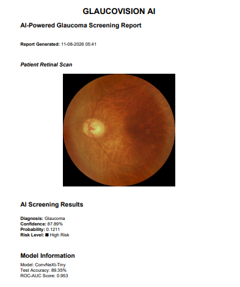

# GLAUCOVISION AI

## AI-Powered Glaucoma Screening System using ConvNeXt-Tiny

**GLAUCOVISION AI** is an end-to-end deep learning application for automated glaucoma screening from retinal fundus images. The system uses a fine-tuned **ConvNeXt-Tiny** model to classify retinal images as **Normal** or **Glaucoma**, estimate prediction confidence, provide screening-oriented risk assessment, generate prediction explanations, and produce downloadable PDF reports through a Streamlit web application.

<p align="center">
  <a href="https://glaucovisionai-2gmtotw5bz5epjwxdpygry.streamlit.app/">
    <strong>Live Demo</strong>
  </a>
</p>

---

## Project Overview

Glaucoma is a progressive eye disease that can lead to irreversible vision loss. Early screening can help identify individuals who may require further ophthalmological evaluation.

The objective of this project was to build a **complete AI system rather than stopping at model training**, covering:

**Data Preparation → Model Development → Fine-Tuning → Evaluation → Inference → Web Application → PDF Reporting → Cloud Deployment**

---

## Application Preview

The trained model is integrated into a browser-based Streamlit application supporting retinal image upload, real-time inference, confidence/risk assessment, prediction explanation, and automated screening reports.

<p align="center">
  
</p>

### AI Screening Result

The application displays the predicted class, confidence, class probability, screening-oriented risk level, and prediction explanation.

<p align="center">
  
</p>

### Probability Interpretation

The model output displayed as **Probability** represents the **Normal-class probability**.

For a binary classification output:

```text
Normal Probability = P(Normal)
Glaucoma Probability = 1 - P(Normal)
```

For example, if:

```text
Normal Probability = 0.1211
```

then:

```text
Normal Probability    = 12.11%
Glaucoma Probability  = 87.89%
```

Therefore, the application predicts **Glaucoma** with approximately **87.89% confidence** for that example.

> These probabilities are model outputs and are not clinically calibrated probabilities or a medical diagnosis.

---

## Problem Statement

The project explores how deep learning can assist retinal image screening by providing fast and accessible automated predictions.

The system is designed as a **screening-oriented research prototype**, not as a replacement for professional ophthalmological diagnosis.

---

## Dataset

The dataset contains retinal fundus images belonging to two classes:

- **Normal**
- **Glaucoma**

| Split | Images |
|---|---:|
| Training | 8,000 |
| Validation | 770 |
| Test | 770 |
| **Total** | **9,540** |

| Property | Value |
|---|---|
| Classification | Binary |
| Original Resolution | 512 × 512 |
| Model Input | 384 × 384 × 3 |
| Classes | Normal, Glaucoma |

The dataset was separated into training, validation, and test sets so that model development and final evaluation were performed on independent data.

---

## 🧠 Why ConvNeXt-Tiny?

**ConvNeXt-Tiny** was selected because it provides a practical balance between:

- Visual feature extraction capability
- Classification performance
- Computational requirements
- Transfer-learning effectiveness
- Deployment feasibility

The architecture was adapted to the retinal image classification task using **transfer learning and fine-tuning**, allowing pretrained visual representations to be specialized for the target dataset.

---

## ⚙️ Methodology

### 1. Image Preprocessing

Uploaded retinal images are:

- Resized to `384 × 384`
- Converted to RGB
- Converted into model-ready numerical tensors
- Batched before inference

### 2. Model Development

| Component | Configuration |
|---|---|
| Architecture | **ConvNeXt-Tiny** |
| Approach | **Transfer Learning + Fine-Tuning** |
| Task | Binary Classification |
| Classes | Normal / Glaucoma |
| Input | 384 × 384 × 3 |

### 3. Evaluation

The model was evaluated on an independent test set using:

- Accuracy
- ROC-AUC
- Precision
- Recall
- F1-Score
- Confusion Matrix
- Error analysis

---

# Model Performance

The final fine-tuned ConvNeXt-Tiny model was evaluated on **770 independent test images**.

| Metric | Result |
|---|---:|
| **Test Accuracy** | **89.35%** |
| **ROC-AUC** | **0.9536** |
| **Macro F1-Score** | **0.89** |
| **Test Samples** | **770** |

The model achieved **89.35% test accuracy** with a **ROC-AUC of 0.9536**, demonstrating strong discrimination between the evaluated Normal and Glaucoma classes.

### Confusion Matrix

<p align="center">
  
</p>

The test-set confusion matrix contains:

- **340** correctly classified Glaucoma images
- **348** correctly classified Normal images
- **45** Glaucoma images classified as Normal
- **37** Normal images classified as Glaucoma

### ROC Curve

<p align="center">
  
</p>

The ROC curve achieves an **AUC of 0.9536**, indicating strong ranking ability across classification thresholds.

### Classification Report

| Class | Precision | Recall | F1-Score | Support |
|---|---:|---:|---:|---:|
| Glaucoma | 0.90 | 0.88 | 0.89 | 385 |
| Normal | 0.89 | 0.90 | 0.89 | 385 |
| **Macro Avg** | **0.89** | **0.89** | **0.89** | **770** |
| **Weighted Avg** | **0.89** | **0.89** | **0.89** | **770** |

---

## Prediction Pipeline

```text
User Upload
     ↓
Image Validation
     ↓
Image Resize
     ↓
RGB Conversion
     ↓
Model Input Preparation
     ↓
ConvNeXt-Tiny Inference
     ↓
Normal Probability
     ↓
Glaucoma Probability = 1 - Normal Probability
     ↓
Prediction / Confidence
     ↓
Screening Risk Assessment
     ↓
Prediction Explanation
     ↓
PDF Report Generation
     ↓
User Download
```

---

## Application Features

### AI Features

- Glaucoma classification
- Normal and Glaucoma probability estimation
- Prediction confidence
- Screening-oriented risk assessment
- Prediction explanation
- Real-time ConvNeXt-Tiny inference

### Application Features

- Retinal image upload
- Image preview
- Real-time inference
- Automated PDF screening report
- Input/error handling
- Light and dark theme support
- Browser-based interface

### Screening Report

The system generates a downloadable PDF containing the retinal image, screening result, confidence, risk assessment, and model information.

<p align="center">
  
</p>

### Deployment

- GitHub-based version control
- Streamlit Community Cloud deployment
- Cloud-based model retrieval
- End-to-end deployed inference

---

## System Architecture

```text
                         GLAUCOVISION AI
                                |
                 +--------------+--------------+
                 |                             |
           Streamlit UI                  ML Pipeline
                 |                             |
           Image Upload                 Preprocessing
                 |                             |
           Image Preview                ConvNeXt-Tiny
                 |                             |
                 |                         Prediction
                 |                             |
                 +--------------+--------------+
                                |
                       Probability / Confidence
                                |
                         Risk Assessment
                                |
                         Prediction Explanation
                                |
                         PDF Report Generation
                                |
                           User Download
```

---

## Engineering Highlights

- Built an **end-to-end computer vision inference pipeline** rather than a standalone training notebook.
- Applied **transfer learning and fine-tuning with ConvNeXt-Tiny**.
- Evaluated the model using **ROC-AUC, precision, recall, F1-score, accuracy, and confusion matrix analysis**.
- Integrated the trained model into a **Streamlit web application**.
- Implemented automated **PDF screening report generation** using ReportLab.
- Added probability, confidence, and screening-oriented risk assessment logic.
- Separated prediction and reporting functionality into modular utilities.
- Addressed deployment constraints involving **Python/TensorFlow compatibility, dependency installation, memory limitations, and cloud runtime configuration**.

---

## Current Limitation

The current classifier assumes that the uploaded image belongs to the retinal fundus image distribution.

Because the model is trained for only two classes, arbitrary non-retinal images could still be assigned to either **Normal** or **Glaucoma**.

A stronger production-oriented architecture would introduce an input-domain validation stage before glaucoma classification.

```text
Uploaded Image
      ↓
Fundus Image Validation / OOD Detection
      ↓
   Valid Fundus?
    /          \
   No          Yes
   ↓            ↓
 Reject     ConvNeXt-Tiny
                ↓
        Normal / Glaucoma
```

This limitation motivates future work involving **fundus-image validation and out-of-distribution detection**.

---

## Future Improvements

- Fundus-image validation
- Out-of-distribution detection
- Larger and more diverse datasets
- External clinical validation
- Probability calibration
- Multi-disease retinal screening
- Model optimization for lower-latency inference

---

## Technology Stack

| Category | Technologies |
|---|---|
| Programming | Python |
| Deep Learning | TensorFlow, Keras |
| Model | ConvNeXt-Tiny |
| Image Processing | Pillow, NumPy |
| Web Application | Streamlit |
| PDF Generation | ReportLab |
| Model Retrieval | gdown |
| Version Control | Git, GitHub |
| Deployment | Streamlit Community Cloud |

---

## Project Structure

```text
GLAUCOVISION_AI_DEPLOY/
│
├── app.py
├── requirements.txt
├── README.md
│
├── assets/
│   ├── doctor_bg.jpg
│   ├── glaucoma_eye.jpg
│   ├── healthy_eye.jpg
│   ├── confusion_matrix.png
│   ├── roc_curve.png
│   ├── app_ui.png
│   ├── prediction_results.png
│   └── pdf_report.png
│
├── utils/
│   ├── __init__.py
│   ├── predict.py
│   ├── gradcam.py
│   └── pdf_report.py
│
└── notebooks/
    └── Glaucoma_detection.ipynb
```

---

## Local Setup

### Clone Repository

```bash
git clone https://github.com/saiii-vardhan08/GLAUCOVISION_AI_DEPLOY.git
cd GLAUCOVISION_AI_DEPLOY
```

### Install Dependencies

```bash
pip install -r requirements.txt
```

### Run Application

```bash
streamlit run app.py
```

---

## Deployment

The application is deployed using **Streamlit Community Cloud** with the GitHub repository as the source of the application.

**Live Application:**  
https://glaucovisionai-2gmtotw5bz5epjwxdpygry.streamlit.app/

---

## Medical Disclaimer

**GLAUCOVISION AI is an educational and research-oriented screening system, not a medical diagnostic device.**

Model predictions may contain false positives and false negatives. The system should not replace professional ophthalmological examination, diagnosis, or treatment.

The reported performance represents evaluation on the project's test dataset and should not be interpreted as clinical validation or evidence of real-world diagnostic performance.

---

# Author

## K. Saivardhan Goud

**B.Tech — Electronics & Communication Engineering**  
**KL University, Hyderabad**

**Current CGPA: 9.84**

### Specialization

**Generative AI**

### Areas of Interest

- Artificial Intelligence
- Machine Learning
- Deep Learning
- Computer Vision
- Generative AI
- End-to-End AI Engineering

Focused on building practical AI systems that combine **problem identification, data analysis, model development, evaluation, optimization, software engineering, and deployment**.

### Links

- **GitHub:** https://github.com/saiii-vardhan08
- **LinkedIn:** https://www.linkedin.com/in/saivardhangoudk08
- **Live Demo:** https://glaucovisionai-2gmtotw5bz5epjwxdpygry.streamlit.app/

---

## Project Summary

**GLAUCOVISION AI** demonstrates an end-to-end approach to computer vision engineering:

**Problem → Data → Preprocessing → Transfer Learning → Fine-Tuning → Evaluation → Inference → Web Application → Reporting → Deployment**

The project focuses not only on model accuracy, but also on **reproducibility, engineering integration, deployment, and responsible AI limitations**.
